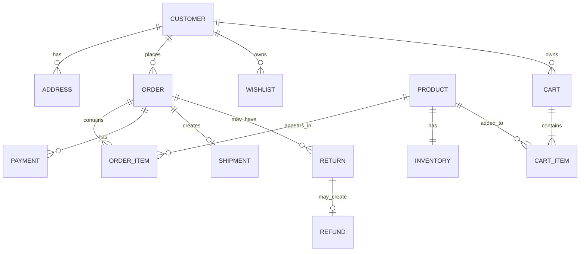

# Entity Relationship Diagram

```mermaid
erDiagram
    CUSTOMER ||--o{ ADDRESS : has
    CUSTOMER ||--o{ ORDER : places
    CUSTOMER ||--o{ WISHLIST : owns
    PRODUCT ||--o{ ORDER_ITEM : appears_in
    PRODUCT ||--|| INVENTORY : has
    ORDER ||--|{ ORDER_ITEM : contains
    ORDER ||--o{ PAYMENT : has
    ORDER ||--o| SHIPMENT : creates
    ORDER ||--o{ RETURN : may_have
    RETURN ||--o| REFUND : may_create
    CUSTOMER ||--o{ CART : owns
    CART ||--|{ CART_ITEM : contains
    PRODUCT ||--o{ CART_ITEM : added_to
```
